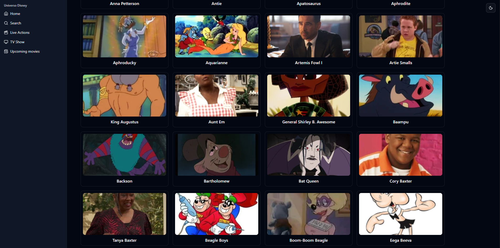

# Disney Characters

Bem-vindo ao **Disney Characters**! Este é um aplicativo web simples que exibe uma lista de personagens do universo Disney, consumindo dados de uma API.

## Acesse o Projeto Online

Acesse a versão online do projeto:  
[https://discharactersapi.netlify.app/](https://discharactersapi.netlify.app/)

## Captura de Tela

Insira abaixo uma imagem do projeto em funcionamento:



## Tecnologias Utilizadas

- **Vite**: Empacotador de código para desenvolvimento front-end moderno.
- **React**: Biblioteca JavaScript para construção de interfaces de usuário.
- **TypeScript**: Superset do JavaScript que adiciona tipagem estática.
- **shadcn/ui**: Coleção de componentes de UI reutilizáveis e acessíveis.

## Como Executar o Projeto

Siga os passos abaixo para rodar o projeto localmente:

1. **Clone o repositório:**

   ```bash
   git clone https://github.com/seu-usuario/disney-characters.git
   cd disney-characters
   ```

2. **Instale as dependências**

   ```bash
   npm install
   ```

3. **Inicie o servidor de desenvolvimento:**
   ```bash
   npm run dev
   ```

## Próximos Passos

- **Campo de Busca:** Permitir que usuários encontrem personagens específicos.
- **Organização de Conteúdo:** Preencher as abas "Live Actions", "TV Shows" e "Upcoming Movies" com conteúdos correspondentes.
- **Melhorias na UI/UX:** Tornar a interface mais responsiva.
